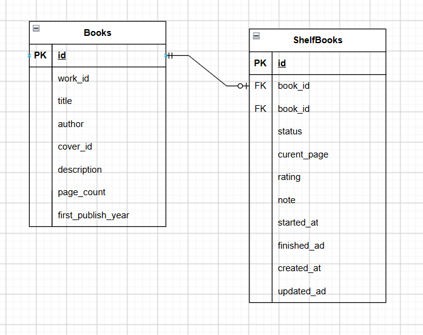

# 📚 Reading Tracker

Reading Tracker là ứng dụng quản lý quá trình đọc sách cá nhân.

Ứng dụng cho phép người dùng tìm kiếm sách thông qua Open Library API, xem thông tin chi tiết của sách và quản lý các sách trong tủ sách cá nhân.

Các chức năng chính:

* 🔎 Tìm kiếm sách.
* 📖 Xem chi tiết sách.
* 📚 Thêm sách vào tủ sách.
* 📊 Theo dõi tiến độ đọc.
* 🔄 Quản lý trạng thái đọc.
* ⭐ Đánh giá sách.
* 📝 Ghi chú cho sách.
* 🗑️ Xóa sách khỏi tủ sách.

---

## 1. 🎯 Project Overview

Reading Tracker được xây dựng theo mô hình Frontend - Backend - Database.

Frontend chịu trách nhiệm hiển thị giao diện và tương tác với người dùng.

Backend cung cấp REST API, xử lý business logic, giao tiếp với Open Library API và quản lý dữ liệu trong MySQL.

Database sử dụng MySQL để lưu trữ thông tin sách và dữ liệu tủ sách.

---

## 2. ✨ Main Features

### 2.1. Search Books

Người dùng có thể tìm kiếm sách theo từ khóa.

Frontend gửi request tới Backend:

```text
GET /api/v1/books/search?q={keyword}&page={page}&limit={limit}
```

Backend gọi Open Library API và chuẩn hóa dữ liệu trước khi trả về Frontend.

---

### 2.2. Book Detail

Người dùng có thể xem thông tin chi tiết của một tác phẩm.

```text
GET /api/v1/books/{workId}
```

Thông tin có thể bao gồm:

* Tên sách.
* Tác giả.
* Mô tả.
* Ảnh bìa.
* Thể loại/chủ đề.
* Ngày xuất bản đầu tiên.
* Số trang.

---

### 2.3. Shelf Book

Người dùng có thể thêm sách vào tủ sách cá nhân và quản lý:

* Trạng thái đọc.
* Số trang hiện tại.
* Rating.
* Note.
* Ngày bắt đầu đọc.
* Ngày hoàn thành.

Các trạng thái đọc:

```text
WANT_TO_READ
READING
COMPLETED
```

---

## 3. 🛠️ Technologies

### Frontend

* Vue 3
* TypeScript
* Vite
* Vue Router
* Ant Design Vue
* Axios

### Backend

* Node.js
* Express.js
* TypeScript
* TypeORM
* Axios (gọi Open Library API, nếu đang được sử dụng trong service)

### ORM

* TypeORM

TypeORM được sử dụng để:

* Mapping Entity với database.
* Thực hiện các thao tác CRUD.
* Quản lý quan hệ giữa các bảng.
* Hạn chế việc viết SQL trực tiếp trong business logic.
* Tách database access khỏi Service Layer.

### Database

* MySQL

### External API

* Open Library API

Các API bên ngoài được sử dụng:

```text
GET https://openlibrary.org/search.json?q={keyword}&page={n}&limit=20

GET https://openlibrary.org/works/{workId}.json

GET https://covers.openlibrary.org/b/id/{coverId}-M.jpg
```

Frontend **không gọi trực tiếp Open Library API**. Request được thực hiện thông qua Backend.

---

## 4. 🏗️ System Architecture

Kiến trúc tổng quát:

```text
┌─────────────────────────┐
│       Vue.js             │
│       Frontend           │
└────────────┬────────────┘
             │
             │ HTTP / REST API
             ▼
┌─────────────────────────┐
│   Node.js + Express      │
│       TypeScript         │
├─────────────────────────┤
│ Controllers              │
│ Services                 │
│ Repositories             │
│ TypeORM Entities         │
└───────┬─────────┬───────┘
        │         │
        │         │ HTTP Request
        │         ▼
        │   ┌─────────────────┐
        │   │  Open Library   │
        │   │      API        │
        │   └─────────────────┘
        │
        ▼
┌─────────────────────────┐
│         MySQL            │
│    Reading Tracker DB    │
└─────────────────────────┘
```

### Backend Architecture

Backend được tổ chức theo các layer:

```text
Request
   ↓
Route
   ↓
Controller
   ↓
Service
   ↓
Repository
   ↓
TypeORM
   ↓
MySQL
```

Trong đó:

### Route

Định nghĩa endpoint và chuyển request tới Controller.

### Controller

* Nhận HTTP request.
* Validate các input cơ bản.
* Gọi Service.
* Trả HTTP response.

### Service

Chứa business logic của ứng dụng.

Ví dụ:

* Tìm kiếm sách.
* Lấy thông tin sách từ Open Library.
* Quản lý tủ sách.
* Cập nhật tiến độ đọc.

### Repository

Đảm nhiệm việc giao tiếp với database thông qua TypeORM.

### Entity

Định nghĩa mapping giữa TypeScript class và database table.

Ví dụ:

```text
Book Entity
    ↓
books table

ShelfBook Entity
    ↓
shelf_books table
```

---

## 5. 🗄️ Database Design

Database sử dụng MySQL.

Các Entity chính:

```text
Book
ShelfBook
```

### Book

Lưu thông tin của tác phẩm lấy từ Open Library.

Các thông tin chính:

```text
id
workId
title
authors
coverId
coverUrl
description
subjects
firstPublishDate
numberOfPages
createdAt
updatedAt
```

### ShelfBook

Lưu thông tin sách mà người dùng đang quản lý trong tủ sách.

Các thông tin chính:

```text
id
bookId
status
currentPage
rating
note
startedAt
finishedAt
createdAt
updatedAt
```

### Relationship

```text
Book
 │
 │ 1 : 1
 │
 ▼
ShelfBook
```



---

## 6. 🔄 Main Application Flow

### Search Book

```text
User
 │
 ▼
Frontend
 │
 │ GET /api/v1/books/search
 ▼
Book Route
 │
 ▼
Book Controller
 │
 ▼
Open Library Service
 │
 │ HTTP Request
 ▼
Open Library API
 │
 ▼
Service xử lý dữ liệu
 │
 ▼
Controller
 │
 ▼
Frontend
```

---

### Add Book To Shelf

```text
User
 │
 ▼
Frontend
 │
 ▼
Backend
 │
 ▼
Controller
 │
 ▼
Service
 │
 ▼
Repository
 │
 ▼
TypeORM
 │
 ▼
MySQL
```

---

### Update Reading Progress

```text
Frontend
    │
    ▼
Controller
    │
    ▼
ShelfBook Service
    │
    ▼
ShelfBook Repository
    │
    ▼
TypeORM
    │
    ▼
MySQL
```

Khi số trang hiện tại đạt tổng số trang của sách, trạng thái có thể được cập nhật thành:

```text
COMPLETED
```

---

## 7. 🌐 API

### Book APIs

#### Search Books

```http
GET /api/v1/books/search
```

Query parameters:

```text
q
page
limit
```

Example:

```text
GET /api/v1/books/search?q=harry&page=1&limit=20
```

Response:

```json
{
  "success": true,
  "data": {
    "total": 100,
    "page": 1,
    "limit": 20,
    "books": []
  }
}
```

---

#### Get Book Detail

```http
GET /api/v1/books/:workId
```

Example:

```text
GET /api/v1/books/OL45804W
```

---

### Shelf Book APIs

> Cập nhật danh sách endpoint thực tế sau khi hoàn thành toàn bộ Shelf Book API.

```http
POST /api/v1/shelf-books
GET /api/v1/shelf-books
PATCH /api/v1/shelf-books/:id/progress
PATCH /api/v1/shelf-books/:id/rating
PATCH /api/v1/shelf-books/:id/note
DELETE /api/v1/shelf-books/:id
```

---

## 8. 📋 Business Rules

Các business rules chính:

1. Không cho phép thêm một sách trùng vào tủ sách.
2. `currentPage` phải lớn hơn hoặc bằng `0`.
3. `currentPage` không được lớn hơn tổng số trang của sách.
4. Rating là số nguyên từ `1` đến `5` hoặc để trống.
5. Khi số trang hiện tại bằng tổng số trang, trạng thái sách chuyển sang `COMPLETED`.
6. Khi sách chuyển sang `READING` lần đầu, ghi nhận `startedAt`.
7. Khi sách chuyển sang `COMPLETED`, ghi nhận `finishedAt`.
8. Backend phải validate dữ liệu đầu vào.
9. Các lỗi API được trả về theo format thống nhất.

---

# 9. 🚀 Local Development By Docker
### 6.1. Yêu cầu

-   Git
-   Docker Desktop (Windows/macOS) hoặc Docker Engine + Docker Compose
    plugin (Linux)
-   Docker đang chạy trước khi thực hiện các lệnh bên dưới

Kiểm tra:

``` bash
git --version
docker --version
docker compose version
```

### 6.2. Clone repository

Thay `<REPOSITORY_URL>` bằng URL Git repository thực tế:

``` bash
git clone <REPOSITORY_URL>
cd <PROJECT_FOLDER>
```

Chạy các lệnh tiếp theo tại thư mục gốc, nơi chứa `docker-compose.yml`.

### 6.3. Tạo file `.env`

Tạo file `.env` từ file mẫu ở thư mục gốc.

**Windows PowerShell:**

``` powershell
Copy-Item .env.example .env
```

**macOS/Linux/Git Bash:**

``` bash
cp .env.example .env
```

File `.env.example` cần có các biến sau:

``` dotenv
MYSQL_ROOT_PASSWORD=change_this_root_password
MYSQL_DATABASE=reading_tracker
MYSQL_USER=reading_user
MYSQL_PASSWORD=change_this_password
```

Có thể thay các giá trị mật khẩu trong `.env` bằng giá trị riêng. Không
commit `.env` lên Git. Giữ file `.env.example` trong repository nhưng
không đặt mật khẩu thật trong file này.

Docker Compose dùng các biến trên để khởi tạo MySQL. Với volume database
đã được khởi tạo từ trước, thay đổi các biến trong `.env` không tự đổi
mật khẩu/tài khoản bên trong MySQL.


# 10. 📦 TypeScript Configuration

Backend sử dụng TypeScript với ES Module.

Các cấu hình chính:

```json
{
  "compilerOptions": {
    "target": "ES2022",
    "module": "ESNext",
    "moduleResolution": "Bundler",
    "rootDir": "./src",
    "outDir": "./dist",
    "strict": true,
    "esModuleInterop": true,
    "experimentalDecorators": true,
    "emitDecoratorMetadata": true
  }
}
```

Project không sử dụng CommonJS.

Code sử dụng:

```typescript
import express from "express";
```

và:

```typescript
export default app;
```


# 11. 🗃️ TypeORM

TypeORM được sử dụng làm ORM cho MySQL.

Ví dụ Entity:

```typescript
@Entity("books")
export class Book {
  @PrimaryGeneratedColumn()
  id!: number;

  @Column({
    name: "work_id",
    type: "varchar",
    length: 255,
    unique: true,
  })
  workId!: string;

  @Column({
    type: "varchar",
    length: 500,
  })
  title!: string;
}
```

Database connection được cấu hình thông qua:

```text
src/config/database.ts
```

TypeORM DataSource đọc thông tin database từ environment variables.

```text
.env
   ↓
database.ts
   ↓
TypeORM DataSource
   ↓
MySQL
```

---

# 12. 🌐 Deployment

Project cần deploy đầy đủ:

```text
Frontend
Backend
Database
```

Ứng dụng production phải truy cập được thông qua HTTPS.

Theo yêu cầu của bài test, README cần mô tả nền tảng deploy và các bước cấu hình.

## 12.1. Frontend Deployment

**Platform:** `[Điền platform thực tế]`

**URL:** `https://...`

Các bước:

1. Push source code lên GitHub/GitLab.
2. Kết nối repository với nền tảng deploy.
3. Chọn thư mục `frontend` nếu project là monorepo.
4. Cài dependencies:

```bash
npm install
```

5. Build:

```bash
npm run build
```

6. Cấu hình Backend URL:

```env
VITE_API_URL=https://<BACKEND_URL>/api
```

7. Deploy Frontend.
8. Truy cập URL production để kiểm tra.

---

## 12.2. Backend Deployment

**Platform:** `[Điền platform thực tế]`

**URL:** `https://...`

Backend sử dụng:

```text
Node.js
Express
TypeScript
TypeORM
MySQL
```

### Build Backend

Trước khi chạy production, compile TypeScript:

```bash
npm run build
```

Kết quả:

```text
src/
   ↓
TypeScript Compiler
   ↓
dist/
```

Sau đó chạy:

```bash
npm run start
```

### Environment Variables

Cấu hình trên nền tảng deploy:

```env
PORT=5000

DB_HOST=<DATABASE_HOST>
DB_PORT=<DATABASE_PORT>
DB_USER=<DATABASE_USER>
DB_PASSWORD=<DATABASE_PASSWORD>
DB_NAME=<DATABASE_NAME>

OPEN_LIBRARY_BASE_URL=https://openlibrary.org
```

Không commit `.env` vào repository.

---

## 12.3. Database Deployment

**Platform:** `[Điền platform thực tế]`

Database sử dụng:

```text
MySQL
```

Cần cấu hình:

```text
DB_HOST
DB_PORT
DB_USER
DB_PASSWORD
DB_NAME
```

Backend sử dụng TypeORM để kết nối tới MySQL.

Database credentials phải được lưu trong environment variables.

---

## 12.4. Deployment Flow

```text
GitHub
  │
  ├───────────────┐
  ▼               ▼
Frontend        Backend
  │               │
  │               ├── TypeScript Build
  │               │
  │               ├── TypeORM
  │               │
  │               ▼
  │             MySQL
  │
  ▼
Production
```

Backend:

```text
Source Code
    ↓
npm install
    ↓
npm run build
    ↓
dist/
    ↓
npm run start
```


# 12. 🔐 Environment Variables

Không commit file:

```text
.env
```

Các thông tin nhạy cảm như:

* Database host.
* Database username.
* Database password.
* Database URL.
* API credentials nếu có.

phải được cấu hình trực tiếp trên môi trường deploy.

---

# 13. 🧪 Sample Data

Project cần có dữ liệu mẫu để có thể kiểm tra ngay sau khi deploy.

Các trạng thái mẫu:

```text
WANT_TO_READ
READING
COMPLETED
```

Một số trường hợp nên có trong dữ liệu test:

* Sách chưa đọc.
* Sách đang đọc.
* Sách đã đọc.
* Tiến độ đọc.
* Rating.
* Note.

---

# 14. ⚠️ Assumptions

Một số giả định của project:

1. Ứng dụng phục vụ một người dùng nên hiện tại chưa triển khai authentication/authorization.
2. Open Library là nguồn dữ liệu sách chính.
3. Dữ liệu tủ sách được lưu trong MySQL.
4. Frontend không gọi trực tiếp Open Library.
5. Backend chịu trách nhiệm giao tiếp với Open Library.
6. `workId` được sử dụng để xác định tác phẩm từ Open Library.
7. TypeORM được sử dụng để quản lý database thay cho việc viết SQL trực tiếp trong application code.
8. Tiến độ đọc dựa trên số trang hiện tại và tổng số trang của sách.

---

# 15. ⚠️ Limitations

Một số hạn chế hiện tại:

* Chưa có hệ thống tài khoản người dùng.
* Chưa hỗ trợ nhiều người dùng.
* Dữ liệu phụ thuộc vào Open Library.
* Một số sách có thể không có ảnh bìa.
* Một số sách có thể không có số trang.
* Một số sách có thể không có mô tả.
* Chất lượng kết quả tìm kiếm phụ thuộc vào Open Library.
* Chưa có authentication/authorization.
* Chưa có hệ thống caching cho Open Library API.

---

# 16. 🔮 Future Improvements

Nếu có thêm thời gian, có thể phát triển:

* Authentication và authorization.
* Quản lý nhiều người dùng.
* Đồng bộ tủ sách theo từng tài khoản.
* Tìm kiếm nâng cao.
* Filter theo thể loại.
* Filter theo tác giả.
* Sorting theo tên, năm xuất bản hoặc tiến độ.
* Thống kê lịch sử đọc.
* Mục tiêu đọc sách theo tháng/năm.
* Caching Open Library API.
* Unit Test.
* Integration Test.
* CI/CD.
* Swagger API documentation.
* Tối ưu performance.
* Responsive/mobile UX.

---

# 17. 📁 Project Structure

```text
reading-tracker/
├── frontend/
│   ├── src/
│   │   ├── components/
│   │   ├── data/
│   │   ├── router/
│   │   ├── services/
│   │   ├── types/
│   │   └── views/
│   ├── .env.example
│   └── package.json
│
├── backend/
│   ├── src/
│   │   ├── config/
│   │   ├── controllers/
│   │   ├── entities/
│   │   ├── middlewares/
│   │   ├── repositories/
│   │   ├── routes/
│   │   ├── seeds/
│   │   ├── services/
│   │   └── usecases/
│   ├── .env.example
│   └── package.json
│
├── docs/
│   ├── screenshots/
│   └── database/
│
└── README.md
```

# 18. 📄 Notes

README này được xây dựng theo yêu cầu của bài test Mini Reading Tracker.

Các nội dung chính gồm:

* Giới thiệu project.
* Công nghệ sử dụng.
* Hướng dẫn chạy local.
* Kiến trúc hệ thống.
* Database và ERD.
* Danh sách API.
* Hướng dẫn deployment.
* Environment variables.
* Sample data.
* Assumptions.
* Limitations.
* Future improvements.

